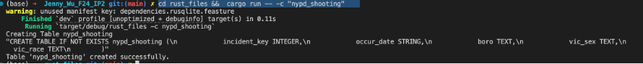
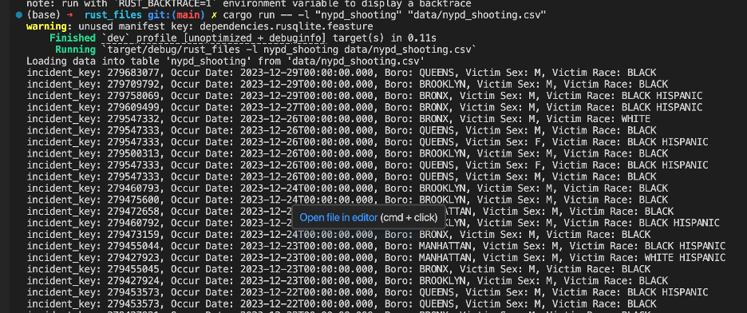
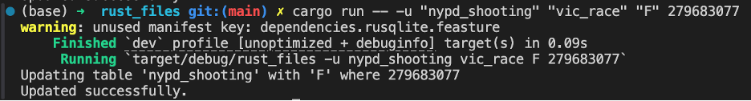
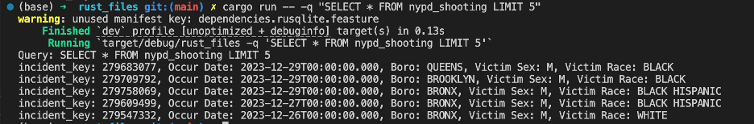
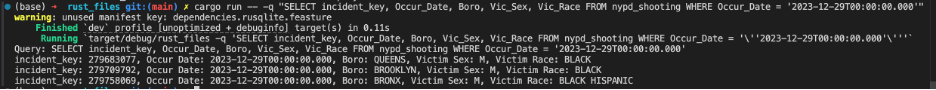
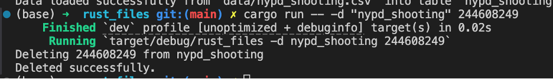

# Jenny_Wu_F24_MP7 & IP2.
[](https://github.com/nogibjj/Jenny_Wu_F24_IP2/actions/workflows/rust_actions.yml)

## Project #2: Rust CLI Binary with SQLite

***

## Purpose: 
The purpose of this project is to take an existing python project, convert it to Rust, and compare the speed and efficiency of both scripts. This projects demonstrates how to perform CRUD operations in both Rust and Python, using a CLI (Command Line Integration) Tool. 

## Project Guidelines: 
Rust source code: The code should comprehensively understand Rust's syntax and unique features.
Use of LLM: In your README, explain how you utilized an LLM in your coding process.
SQLite Database: Include a SQLite database and demonstrate CRUD (Create, Read, Update, Delete) operations.
Optimized Rust Binary: Include a process that generates an optimized Rust binary as a Gitlab Actions artifact that can be downloaded.
README.md: A file that clearly explains what the project does, its dependencies, how to run the program, and how Gitlab Copilot was used.
Github/Gitlab Actions: A workflow file that tests, builds, and lints your Rust code.
Video Demo: A YouTube link in README.md showing a clear, concise walkthrough and demonstration of your CLI binary.

***

## Binary Artifact: https://github.com/nogibjj/Jenny_Wu_F24_IP2/actions/runs/11717299977/artifacts/2156028161

## LLM Usage: 
To help me complete the project, I utilized Codeium to supplement my numerous variable inputs and ChatGPT to check my code. I found that using Codeium was helpful in their suggestions as to how to move forward with my code once I started type a couple of lines to demonstrate what I wanted to achieve. As such, when inputting the list of variables and their respective variable formats, it was quite easy. I used ChatGPT to check my code when I encountered errors and for it to walk me through some of the Rust schemas. I thought that having a bot support helped me learn what I was missing and get me acquainted and recognize common errors I was consistently running into.

***
## Rust Dependencies 

To begin, we will need clap, rusqlite, and csv for dependencies. This can be set up by running the following commands in the terminal:
- [x] cargo add clap --features derive
- [x] cargo add rusqlite
- [x] cargo add csv
After running these commands, the dependencies will appear in the Cargo.toml file.

## Workflow Structure 
Each time a change is made to the code, it will need to be saved and compiled, in order for the program to update itself. This can be done by running:
- [x] Cargo check
- [x] Cargo build
- [x] Cargo build --release
> This cargo build --release command generates a binary file within the project/target/release folder. This file ultimately is what gets returned as a binary artifact when running the GitHub actions. [Binary Artifact] (https://github.com/nogibjj/Jenny_Wu_F24_IP2/actions/runs/11717299977/artifacts/2156028161) 

## CLI and Results: 

To run through the creation, loading, and querying of the table, please following the following steps. 

### Create a table 

Using the created CLI tool to create a table, run the following command. 

```
cd rust_files -- -c {table_name: str}
``` 
Where 
    table_name: the name of the table you would like to create

In this project, as we are looking to create a table named nypd_shooting for the recorded NYPD cases of shootings. 
```
cd rust_files -- -c "nypd_shooting"
```


### Load data into the table 

Now that the directory is in the “rust_files”, we can run all cargo commands as the CLI and Makefile is within this directory. 

To load the data into the created table, we run the following command. Note per the schema of this project, the table must have previously been created to load data. Additionally, this function is preset to have the table created with column names specific to the dataset under rust_files/data/nypd_shooting.csv.

```
cargo run -- -l {table_name: str} {dataset_path: str} 
``` 
Where

    table_name: the name of the table previously created

    dataset_path: the location of which your data is located in relative to the rust_file directory

In relation to this project, we would run the following command. 
```
cargo run -- -l "nypd_shooting" "data/nypd_shooting.csv"  
```



### Updating an observation

To update an observation in the dataset, we would run the following command. 

```
cargo run -- -u {table_name: str} {column_name: str} {new_value: str} {key: int}

```
Where 

    table_name: the name of the table previously created

    column_name: the column of which this variable exists 

    new_value: the desired value change 

    key: the uniqiue ID of the observation 

In the context of this project, we would run the following command. In this command, we are changing the variable, vic_race, in our nypd_shooting database to F for the observation with the incident key of 279683077. 

```
cargo run -- -u "nypd_shooting" "vic_race" "F" 279683077
```


### Read and Query from the dataset 

To read and query specific rows from the nypd_shooting data, we would run the following command.

```
cargo run -- -q {query_string: str}
```
Where 

    query_string: the SQL command you would write in

In the context of this project, the following two commands are commands to read the first 5 lines in the dataset and to pull all incidents that happened on Dec 29, 2023. 

``` 
cargo run -- -q "SELECT * FROM nypd_shooting LIMIT 5"
```


```
cargo run -- -q "SELECT incident_key, Occur_Date, Boro, Vic_Sex, Vic_Race FROM nypd_shooting WHERE Occur_Date = '2023-12-29T00:00:00.000'"

```


### Deleting an observation in the nypd_shooting dataset 

To delete an observation based on the ID key within this specific nypd_shooting dataset, we would run the following command. To delete an observation within a dataset not specific to the nypd_shooting dataset in this project, please use the query function to input a general SQL command. 

```
cargo run -- -d {table_name: str} {incident_key: str}

```
Where 
    table_name: the name of the table previously created 
    
    incident_key: the uniqiue ID of the observation within the nypd_shooting dataset
    


***


## Rust vs Python Speed 

In addition to rewriting the Python script, this project also provides a comparison of Rust and Python's speed and resource usage advantages and disadvantages. Rust is a compiled (or binary deployment) language, meaning that the code compiles into a single executable file. This method is faster and more efficient for users, but has limited flexibility, as binaries are platform-specific.

In comparison, Python is slower, but more user friendly. Packaging deployment is common in Python and involves distributing code as packages. These packages require an interpreter (Python) to run. Unlike Rust, this method is not platform-specific, but is much slower for a couple of reasons, including having to manage more dependencies.

To compare the two, I compared the speed of the Rust and Python code in loading and reading the table. In this project, you can run this by running the following steps: 

To return the speed of the Rust query code that pulls the first 5 rows of the data, please run the following command. 

```
cargo run -- -t "SELECT * FROM nypd_shooting LIMIT 5"

```

To return the speed of the Python query code, please run the following command. This command redirects the directory into the main folder, enters the python_files folder, where all the python files are hosted, and then runs the Python file that holds the code that returns the speed of querying the same SQL command as in the Rust command. This should return the same results as in Rust, but at almost ~28x slower. 

```
cd .. && cd python_files && python time_test.py

```
### Video Walkthrough of Project

